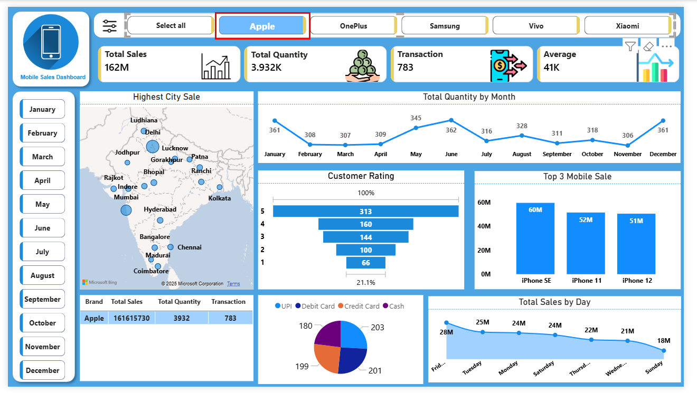
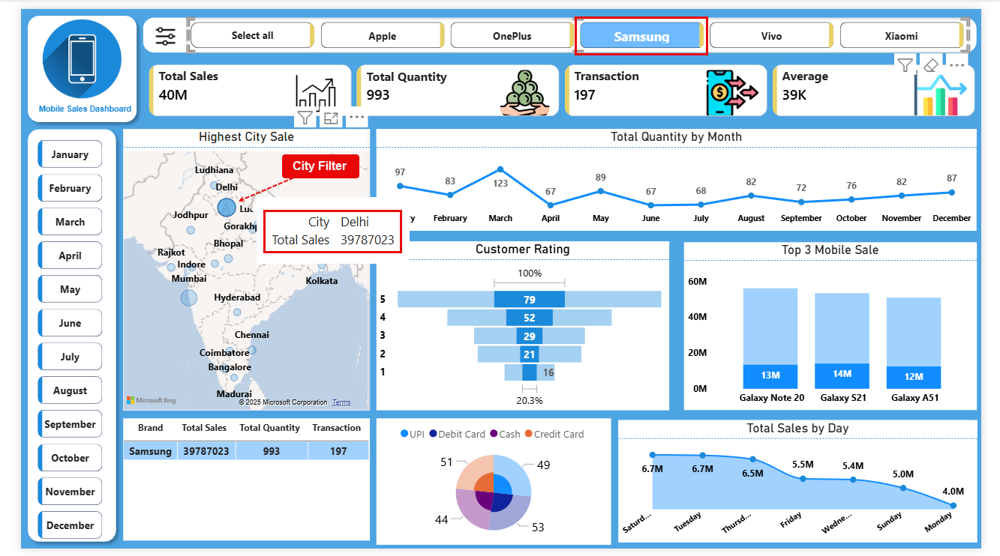

# 📊 Mobile Sales Dashboard | Power BI Data Analytics Project

## 🔍 Project Summary
This project showcases an **end-to-end Power BI Mobile Sales Dashboard**, designed to analyze and visualize mobile phone sales data across multiple brands, cities, time periods, and customer segments.

The dashboard helps stakeholders track **sales performance, revenue trends, customer behavior, and payment preferences** through interactive visuals and KPIs.

**Target Roles:** Data Analyst | Business Analyst | MIS Executive  
**Core Skills:** Power BI, Data Analysis, DAX, Excel, Data Visualization, Business Intelligence

---

## 📂 Dataset Overview
- **Total Records:** 3,835  
- **Total Columns:** 15  
- **Data Type:** Structured mobile sales transaction data  

### Dataset Columns
- Transaction ID  
- Day, Month, Year, Day Name  
- Brand  
- Mobile Model  
- Units Sold  
- Price Per Unit  
- Total Sales  
- Customer Name  
- Customer Age  
- City  
- Payment Method  
- Customer Ratings  

---

## 🧹 Data Cleaning & Transformation
Data preparation was performed in **Power BI** to ensure data accuracy and consistency:
- Validated calculated fields  
  - **Total Sales = Units Sold × Price Per Unit**
- Fixed inconsistent categorical values (e.g., day names)
- Ensured correct data types for numeric and categorical fields
- Checked for missing and duplicate values
- Optimized the data model for reporting performance

---

## 📈 Key KPIs & Metrics
The dashboard highlights important business KPIs:
- **Total Sales Revenue**
- **Total Units Sold**
- **Average Sales per Transaction**
- **Average Customer Rating**
- **Brand-wise and City-wise Sales Contribution**

---

## 📊 Dashboard Visualizations
- Sales by **Brand**
- Sales by **City**
- Monthly and Daily Sales Trends
- Top-Selling Mobile Models
- Payment Method Distribution
- Customer Demographics (Age-based Analysis)

### 🎛️ Interactive Filters
- Brand  
- City  
- Month  
- Day Name  
- Payment Method  

---

## 🖼️ Dashboard Screenshots

> Screenshots improve recruiter engagement and project clarity.

### 🔹 Overall Sales Overview

### 🔹 Brand & Model Performance

### 🔹 City & Payment Insights

### 📁 How to Add Screenshots
1. Open your Power BI dashboard
2. Take screenshots of key report pages
3. Create a folder named **`screenshots`** in the repository
4. Upload images and reference them as shown above

---

## 💡 Business Insights Derived
- Identified **top-performing mobile brands and models**
- Analyzed **city-wise revenue contribution**
- Discovered **most preferred payment methods**
- Observed **seasonal and weekday sales trends**
- Evaluated customer satisfaction using ratings

---

## 🛠️ Tools & Technologies Used
- **Power BI Desktop**
- **DAX (Data Analysis Expressions)**
- **Microsoft Excel**
- **Data Modeling**
- **Data Visualization**
- **Business Intelligence Reporting**

---

## 📁 Project Structure
